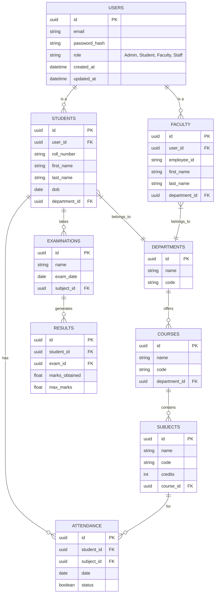

# Database Entity Relationship Diagram (ERD)

*(This ERD illustrates a foundational subset of the core models. Additional models such as Fees, Library, Placements, Hostel, Transport, Alumni, and Notifications will follow a similar relationship structure linked to Users and core academic entities during Phase 3.)*
