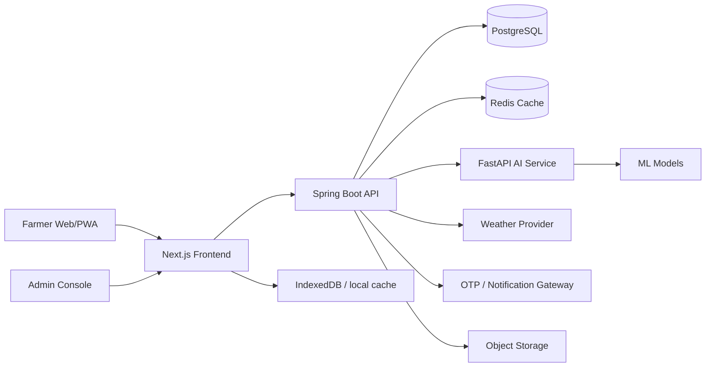
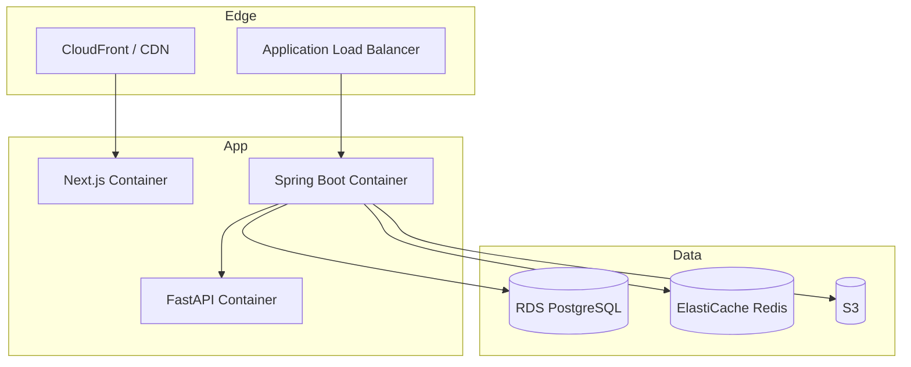

# KrishiAI Architecture

## 1. Product scope

KrishiAI is a decision-support platform for Indian farmers. It combines operational farm records, advisory intelligence, market support, and community workflows in one stack. The product is designed to work as:

- a final-year engineering project with complete modules and demo-friendly data
- a startup-ready platform with clear service boundaries and cloud deployment support

## 2. High-level architecture

## 3. Core subsystems

### Frontend

- Next.js App Router with TypeScript
- Tailwind CSS design system
- React Query for data fetching
- Offline-ready PWA shell
- Mobile-first dashboard and workflows

### Backend

- Spring Boot REST API
- JWT auth with OTP login bootstrap
- Role-based authorization
- JPA/Hibernate persistence
- AI gateway integration layer
- Validation, error handling, audit-ready DTO contracts

### AI service

- FastAPI inference service
- Scikit-learn heuristics for crop and market reasoning
- TensorFlow/OpenCV-ready disease detection interface
- Confidence scores, reasons, and disclaimers in every prediction

## 4. Bounded modules

| Module | Primary responsibility |
|---|---|
| Auth | OTP login, token issuance, role management |
| Farmer | Profile, land, soil, crop history |
| Advisory | Crop recommendation, profit, weather, irrigation |
| Health | Disease detection, treatment recommendations |
| Market | Prices, predictions, selling strategy |
| Schemes | Eligibility scoring, scheme guidance |
| Community | Posts, comments, pest alerts, knowledge sharing |
| Commerce | Marketplace, warehouse, labor exchange |
| Finance | Loan analysis, EMI planning, risk scoring |
| Voice | Multilingual interaction contract |

## 5. Decision-support principles

Every advisory response follows the same pattern:

- `confidenceScore`
- `explanation`
- `riskLevel`
- `recommendedAction`
- `disclaimer`

## 6. Deployment view

## 7. Offline strategy

- cache dashboard summary and saved plans locally
- queue lightweight submissions for retry
- keep disclaimers visible even in cached views
- ship installable manifest and offline shell
