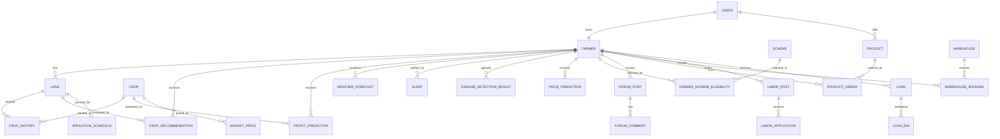

# KrishiAI ER Diagram

```mermaid
erDiagram
    USERS ||--|| FARMER : owns
    FARMER ||--o{ LAND : has
    LAND ||--o{ CROP_HISTORY : records
    CROP ||--o{ CROP_HISTORY : planted_in
    FARMER ||--o{ CROP_RECOMMENDATION : receives
    LAND ||--o{ CROP_RECOMMENDATION : evaluated_for
    FARMER ||--o{ PROFIT_PREDICTION : receives
    CROP ||--o{ PROFIT_PREDICTION : predicted_for
    FARMER ||--o{ WEATHER_FORECAST : monitors
    FARMER ||--o{ ALERT : notified_by
    LAND ||--o{ IRRIGATION_SCHEDULE : planned_for
    FARMER ||--o{ DISEASE_DETECTION_RESULT : uploads
    CROP ||--o{ MARKET_PRICE : priced_as
    FARMER ||--o{ PRICE_PREDICTION : receives
    SCHEME ||--o{ FARMER_SCHEME_ELIGIBILITY : matched_in
    FARMER ||--o{ FARMER_SCHEME_ELIGIBILITY : checked_for
    FARMER ||--o{ FORUM_POST : creates
    FORUM_POST ||--o{ FORUM_COMMENT : has
    USERS ||--o{ PRODUCT : sells
    FARMER ||--o{ PRODUCT_ORDER : buys
    PRODUCT ||--o{ PRODUCT_ORDER : ordered_as
    FARMER ||--o{ WAREHOUSE_BOOKING : books
    WAREHOUSE ||--o{ WAREHOUSE_BOOKING : receives
    FARMER ||--o{ LABOR_POST : creates
    LABOR_POST ||--o{ LABOR_APPLICATION : receives
    FARMER ||--o{ LOAN : borrows
    LOAN ||--o{ LOAN_EMI : schedules
```
