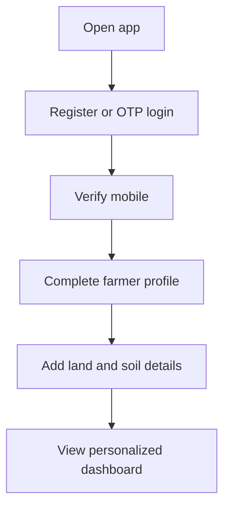
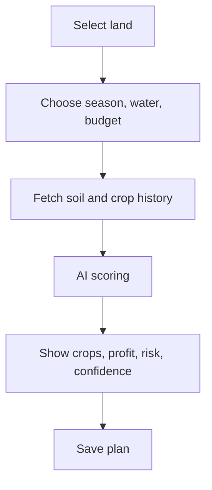
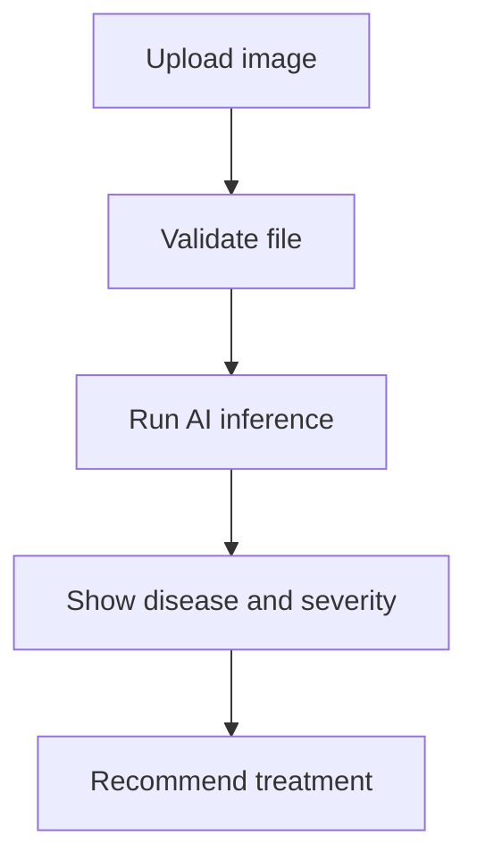

# KrishiAI User Flows

## Farmer onboarding

```mermaid
flowchart TD
    A[Open app] --> B[Register or OTP login]
    B --> C[Verify mobile]
    C --> D[Complete farmer profile]
    D --> E[Add land and soil details]
    E --> F[View personalized dashboard]
```

## Crop recommendation

```mermaid
flowchart TD
    A[Select land] --> B[Choose season, water, budget]
    B --> C[Fetch soil and crop history]
    C --> D[AI scoring]
    D --> E[Show crops, profit, risk, confidence]
    E --> F[Save plan]
```

## Disease detection

```mermaid
flowchart TD
    A[Upload image] --> B[Validate file]
    B --> C[Run AI inference]
    C --> D[Show disease and severity]
    D --> E[Recommend treatment]
```
