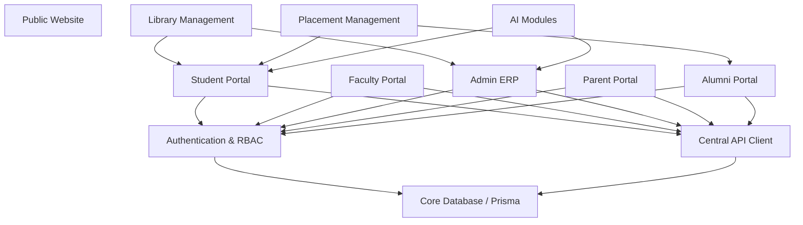

# Module Dependency Diagram

```mermaid
graph TD
    %% Core System Components
    Auth[Authentication & RBAC]
    CoreDB[Core Database / Prisma]
    API[Central API Client]
    
    %% Frontend Modules
    PublicWeb[Public Website]
    StudentPortal[Student Portal]
    FacultyPortal[Faculty Portal]
    AdminERP[Admin ERP]
    ParentPortal[Parent Portal]
    AlumniPortal[Alumni Portal]

    %% Shared Features
    Library[Library Management]
    Placement[Placement Management]
    AI[AI Modules]

    %% Dependencies
    Auth --> CoreDB
    
    StudentPortal --> Auth
    StudentPortal --> API
    
    FacultyPortal --> Auth
    FacultyPortal --> API
    
    AdminERP --> Auth
    AdminERP --> API
    
    ParentPortal --> Auth
    ParentPortal --> API
    
    AlumniPortal --> Auth
    AlumniPortal --> API
    
    API --> CoreDB
    
    Library --> AdminERP
    Library --> StudentPortal
    
    Placement --> StudentPortal
    Placement --> AlumniPortal
    
    AI --> AdminERP
    AI --> StudentPortal
```
